| 姓名     | 学号       | github地址                                                   |
| -------- | ---------- | ------------------------------------------------------------ |
| 方琼     | 3220004819 | [Yarkumonlt/jiedui0 (github.com)](https://github.com/Yarkumonlt/jiedui0) |
| 欧阳琳瑜 | 3220004822 | [hllinyuz](https://github.com/hllinyuz/3220004822/tree/master/) |


# 一、需求分析

该程序需要实现两个大的功能点：一个是出题目，一个是校验题目的对错。按照题目的要求梳理的功能要点如下图所示：

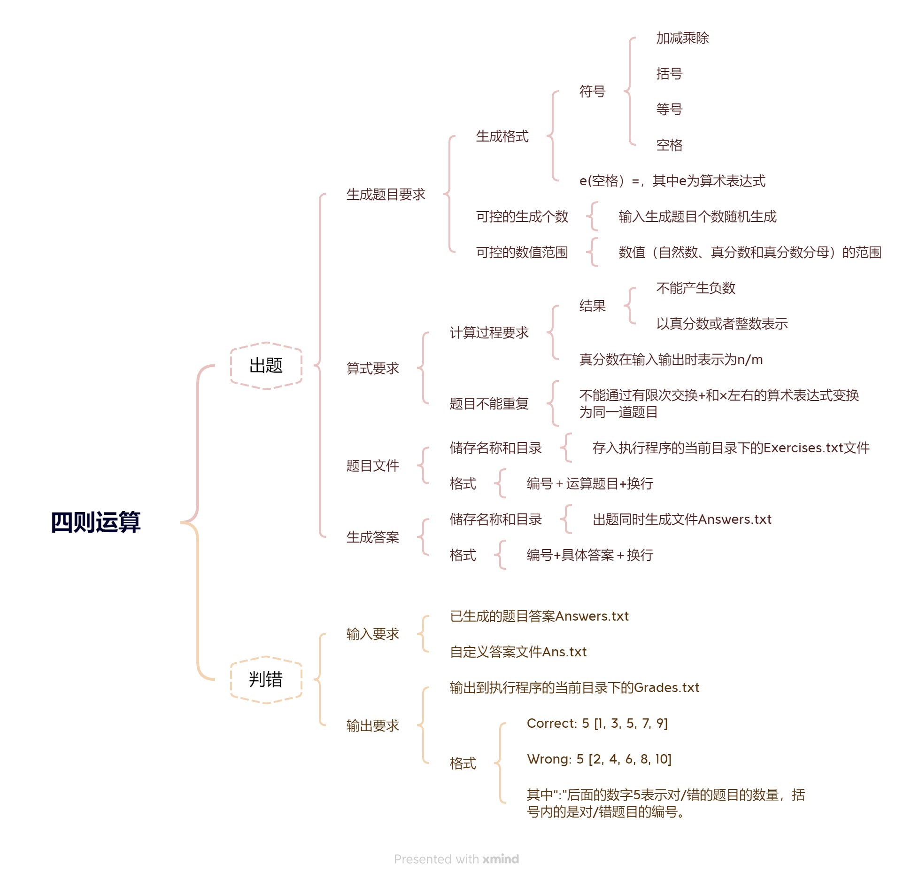

# 二、开发环境

| 开发环境           | 开发语言            |
| ------------------ | ------------------- |
| IntelliJ IDEA 2022 | Java JDK version 15 |

# 三、模块接口的设计实现

## 3.1 系统流程

系统模块主要分为两个模块：出题模块和判错模块。

### 3.1.1 出题模块


### 3.1.2 判错模块

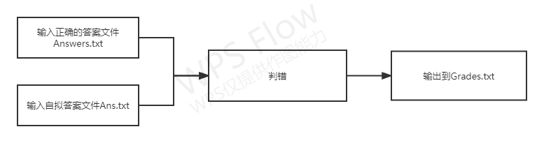

## 3.2 模块设计

### 3.2.1 总述

出题模块涉及的类有：`Calculate、FileBasicOperation、MakeQuestion、MyDC、Rational、Symbol`，判错模块仅为`Check`。

各类之间的关系如下图所示：

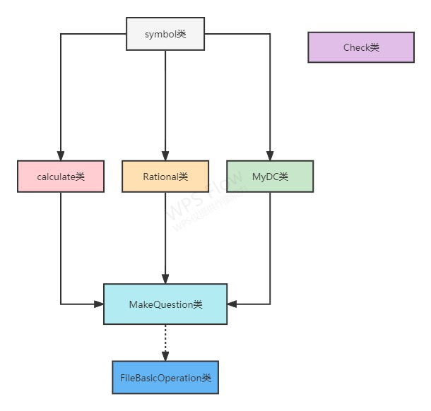

### 3.2.2 各模块的设计

1. 核心设计

   1. Calculate类：核心部分之一，包含了后缀表达式的生成方法和计算答案的方法，主要用于提供整数的计算方法。
   2. MyDC类：核心部分之一，用于分割分数中的分子和分母，按照“分子 / 分母”的形式表达形式呈现。
   3. Rational类：核心部分之一，包括了计算答案的方法，主要用于提供分数的计算方法。

2. 顶层设计

   1. MakeQuestion类：出题模块的顶层部分，可以限制输入题目的个数和输入范围，顶层部分包含一个main方法，提供了随机生成中缀表达式输出到Exercises.txt、计算答案输出到Answers.txt这两部分功能。
   2. Check类：判错模块的顶层模块，通过已生成的题目答案Answers.txt和自定义答案文件Ans.txt进行异或运算，将结果输出到Grades.txt。

3. 其他

   1. FileBasicOperation类：用于清空之前生成的题目文档和答案文档，使后续多次测试能够顺利进行。

   2. Symbol类：为运算提供运算符。

      

# 四、 关键代码说明

## 4.1 生成中缀表达式

中缀表达式即我们日常见到的四则运算表达式，生成中缀表达式的代码放在了MakeQuestion类的main方法里面。为了测试方便，我们将数值输入范围限定到0~9之间并随机输入，总题目数和分数题目的个数也进行随机化。

```java
		Random random = new Random();
        Symbol symbol = new Symbol();//声明类Symbol的对象symbol
        MyDC evaluator = new MyDC();//声明MyDC的对象evaluator
        Rational r = new Rational();//声明Rational的对象r
        Scanner sc = new Scanner(System.in); 
        int ifFraNum;//是否要用分数
        int symNum;//运算符个数
        char sym; //运算符
        int value1, tmpValue;//表达式中出现的随机数
        int value = 0;
        int i, j;

        FileBasicOperation.clearInfoForFile("Exercises.txt");
        FileBasicOperation.clearInfoForFile("Answers.txt");
        System.out.print("请输入要生成的题目数：");
        int x = sc.nextInt();
        outer:
        for (i = 1; i <= x; i++) {
            StringBuilder question = new StringBuilder(); //系统随机生成的表达式question
            ifFraNum = random.nextInt(2) + 1;//生成1到2之间的随机数，表示是否要用分数
            symNum = random.nextInt(5) + 1;//生成1到5之间的运算符个数
            /*如果余为0，不生成分数*/
            if (ifFraNum % 2 == 0) {
                value1 = random.nextInt(10);//表达式中出现的第一个数
                question.append(value1);
                for (j = 1; j <= symNum; j++) { 
                    sym = symbol.makeSymbol();//产生一个运算符sym，共symNum个
                    question.append(sym);//将生成的随机符号存入question中
                    tmpValue = random.nextInt(10);//表示表达式中出现的随机数
                    /*排除除数为0或除不到整数的情况*/
                    if (sym == '÷' && tmpValue == 0) {
                        tmpValue = random.nextInt(9) + 1;
                    }
                    if ((j == 1 && sym == '÷' && value1 % tmpValue != 0) || (sym == '÷' && value % tmpValue != 0)) {
                        i--;
                        continue outer;
                    }
                    value = tmpValue;
                    question.append(value); //将生成的随机数存入question中
                    /*排除负数情况*/
                    if (Calculate.calRp(Calculate.getRp(question.toString())) < 0) {
                        i--;
                        continue outer;
                    }
                }
            }
            /*如果取余为1，生成分数*/
            else {
                for (j = 1; j <= symNum + 1; j++) {
                    r.setNumerator(random.nextInt(3) + 1);//设置分子1到3之间
                    r.setDenominator(random.nextInt(5) + 4); //设置分母是4到8之间
                    
                    int num1 = r.getNumerator();
                    int num2 = r.getDenominator();
                    if (j <= symNum) {
                        sym = symbol.makeSymbol();//产生一个运算符sym
                        question.append(num1).append('/').append(num2).append(" ").append(sym).append(" ");//将生成的随机数和随机符号存入question中
                    } else {
                        question.append(num1).append('/').append(num2);
                        //将生成的随机数存入question中
                        String tmp = evaluator.evaluate(Calculate.fractionRp(question.toString()));
                        if(tmp == null){
                            i--;
                            continue outer;
                        }
                        else if ( tmp.charAt(0) == '-') {
                            i--;
                            continue outer;
                        }
                    }
                }
            }
```


## 4.2 中缀表达式转换为后缀表达式

这是计算答案的前置步骤，为了产生答案更加快捷，我们将生成的中缀表达式以压栈的形式来生成后缀表达式。

```java
public static String fractionRp(String s) {
        char[] arr = s.toCharArray();
        int len = arr.length;
        StringBuilder out = new StringBuilder();
        for (int i = 0; i < len - 2; i++) {//从左到右扫描中缀式
            char ch = arr[i];
            char ch1 = arr[i + 1];
            char ch2 = arr[i + 2];
            if (ch == ' ') continue;
            // 如果是分数，则直接输出
            if (ch >= '0' && ch <= '9' && ch1 == '/' && ch2 >= '0' && ch2 <= '9') {
                out.append(ch);
                out.append(ch1);
                out.append(ch2);
                out.append(" ");
                continue;
            }
            //如果遇到“+”或“-”，则从堆栈中弹出运算符，直到遇到“（”，然后输出，并进栈。
            if (ch == '+' || ch == '-') {
                while (!stack.empty() && (stack.peek() != '('))
                    out.append(stack.pop()).append(" ");
                stack.push(ch);
                continue;
            }
            //如果是“*”或“÷”，则退栈并输出，直到优先级较低或“（”将运算符进栈
            if (ch == '*' || ch == '÷') {
                while (!stack.empty() && (stack.peek() == '*' || stack.peek() == '÷'))
                    out.append(stack.pop()).append(" ");
                stack.push(ch);
                continue;
            }
            //如果遇到“（”，则直接进栈
            if (ch == '(') stack.push(ch);

            if (ch == ')') { //如果遇到“）”一直退栈输出，直到退到“（”，弹出“（”
                while (!stack.empty() && stack.peek() != '(')
                    out.append(stack.pop());
                stack.pop();
            }
        }while (!stack.empty()) out.append(stack.pop());
        return out.toString();//返回值return：后缀形式的字符串
    }
```


## 4.3 计算答案

这部分是描述计算过程的方法，包含两个函数，一个读取后缀表达式进行计算，一个是四则运算。

```java
//参数rp：后缀式
    public static float calRp(String rp) {
        Stack<Float> v = new Stack<>();
        char[] arr = rp.toCharArray();
        // 如果是操作数，则推到堆栈
        for (Character ch : arr) {
            if (ch >= '0' && ch <= '9') v.push((float) (ch - '0'));

                // 如果是运算符，则计算结果
                // 在堆栈中有前2个操作数的情况下，将结果推送到堆栈中

            else v.push(getV(ch, v.pop(), v.pop()));
        }
        //返回值return：表达式结果
        return v.pop();
    }

public static float getV(char op, float f1, float f2) {
        if (op == '+') {return f2 + f1;
        } else if (op == '-') return f2 - f1;
        else if (op == '*') return f2 * f1;
        else if (op == '÷') return f2 / f1;
        else return (float) -0;
    }
```


# 五、 效能分析

## 5.1 出题模块

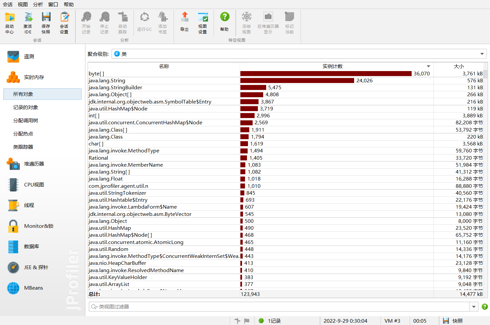

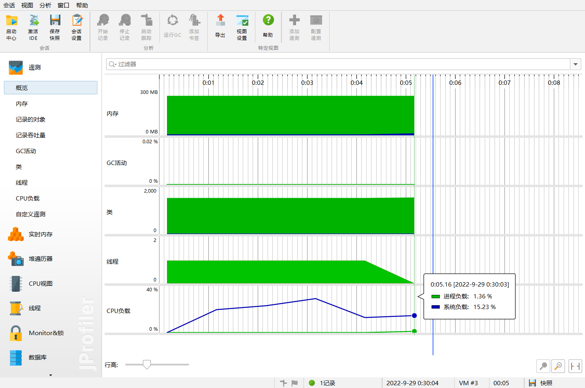

## 5.2 判错模块


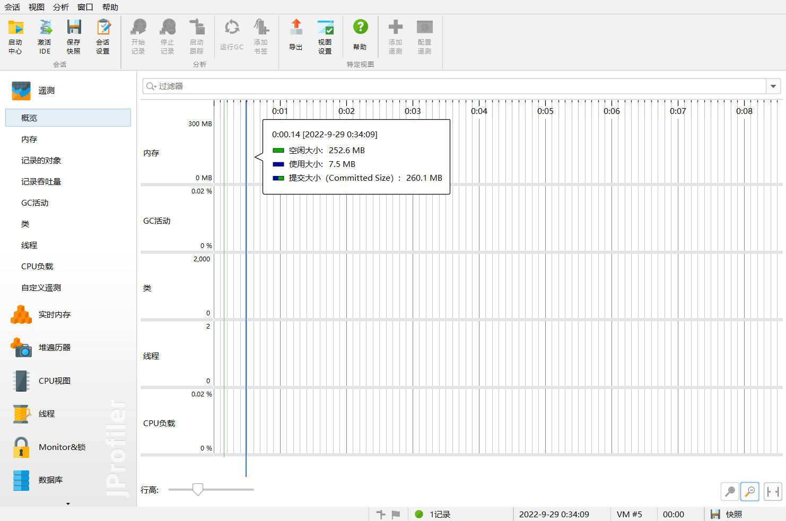

# 六、测试运行

运行MakeQuestion程序，下图是在IntelliJ IDEA 2022的显示结果，输入生成的题目个数，在当前目录下的Exercises.txt自动生成题目，在Answers.txt自动生成答案。


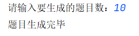

打开Exercises.txt，如下所示：

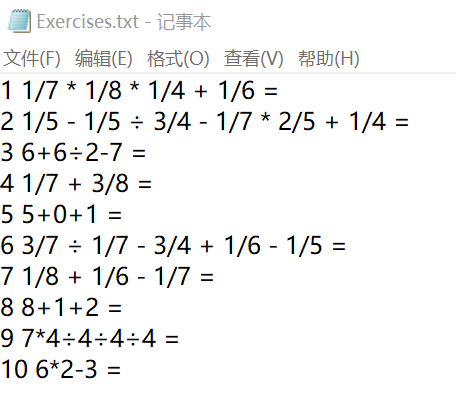

打开Answers.txt，如下所示：

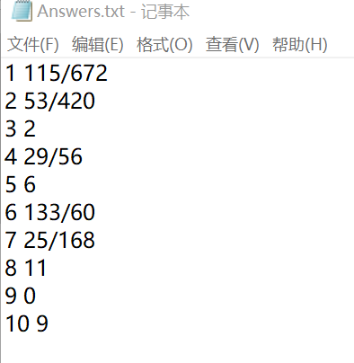

自行录入Ans.txt。

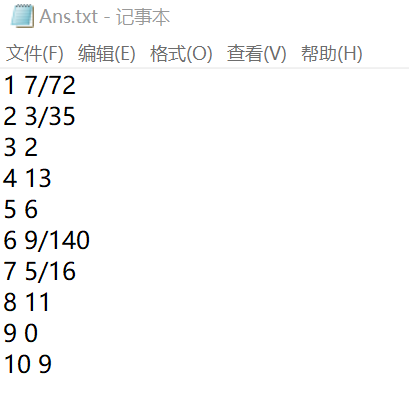


运行Check程序，在grades.txt显示如下：

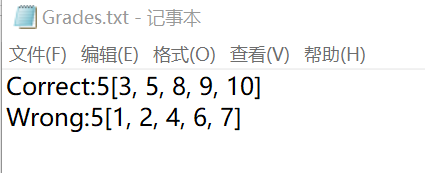

# 七、项目小结

## 7.1 个人小结-欧阳琳瑜

这是我第一次和别人一起合作完成项目作业，感觉我的结对伙伴很不错，或许是结对编程的缘故，老师这次给的项目作业比上次论文查重作业难很多，时间仓促，我们完成的也不算完美，还有很大的提升空间。此外，第一次合作，我们完成项目的时间比平时自己独立完成长了许多。比如在四则运算里，遇到除法除不尽时，用分数表示我们只会有两个操作数的运算，除法之后再接上整数的加减乘除会出问题，最后我们的解决方案是只出除的尽的除法。分数的则额外出分数的题目。在这里我想到的一个解决方案是把整数都变成分母为1的分数再计算，但由于时间关系没有去实现。另外，关于出题，为了节省程序运行的空间，我们是出一题就打开文件写入，而不是全部出完再写，这样导致无意义的文件开关多了起来，浪费了时间。我们有想过把所有题目存成一个string再写入，但java的string最长只有6万多，一次性出一万题的话会报错；或者生成数组存题目，但这样会导致占用过多的空间。

​	我切实感受到结对编程的好处是在前期准备阶段和开发时遇到问题的时候，两个人一起可以讨论设计方案，能够发现许多我一个人没法发现的问题，同时解决问题的思路也多了，不像我自己的时候容易一根筋卡住。但这毕竟第一次合作，我们磨合不足的地方，最简单的比如编码格式，编码习惯，参数命名等，我有个坏习惯是喜欢用拼音和无意义的abcd，这点琼姐帮我更正了；还有我们两平时在编程时间安排不同，导致在这次作业中都不能以最舒服的时间做作业。

## 7.2 个人小结-方琼

本次结对编程由于我个人编程能力较弱，承担了较少部分的编码工作，我主要负责需求分析、生成设计文档、设计复审、测试、部分报告内容，由于时间较为紧迫，还有部分问题还尚待解决，也算是遗憾，但通过这次结对编程让我个人加强了我交流和合作的能力，同时结对编程在项目后期的测试模块上助力很大，比起一个人编程更容易找出错误在哪，收获颇丰。

# 附录

## PSP表格


| PSP2.1                                  | Personal Software Process Stages         | 预估耗时（分钟） | 实际耗时（分钟） |
| --------------------------------------- | ---------------------------------------- | ---------------- | ---------------- |
| Planning                                | 计划                                     | 20               | 20               |
| - Estimate                              | - 估计这个任务需要多少时间               | 20               | 20               |
| Development                             | 开发                                     | 330              | 405              |
| - Analysis                              | - 需求分析（包括学习新技术）             | 30               | 40               |
| - Design Spec                           | - 生成设计文档                           | 50               | 60               |
| - Design Review                         | - 设计复审                               | 10               | 5                |
| - Coding Standard                       | - 代码规范（为目前的开发制定合适的规范） | 5                | 5                |
| - Design                                | - 具体设计                               | 20               | 20               |
| - Coding                                | - 具体编码                               | 135              | 240              |
| - Code Review                           | - 代码复审                               | 20               | 20               |
| - Test                                  | -测试（自我测试、修改代码、提交修改）    | 60               | 60               |
| Reporting                               | 报告                                     | 100              | 105              |
| - Test Repor                            | - 测试报告                               | 30               | 30               |
| - Size Measurement                      | - 计算工作量                             | 5                | 5                |
| - Postmortem & Process Improvement Plan | - 事后总结，并提出过程改进计划           | 65               | 70               |
|                                         | - 合计                                   | 450              | 530              |
